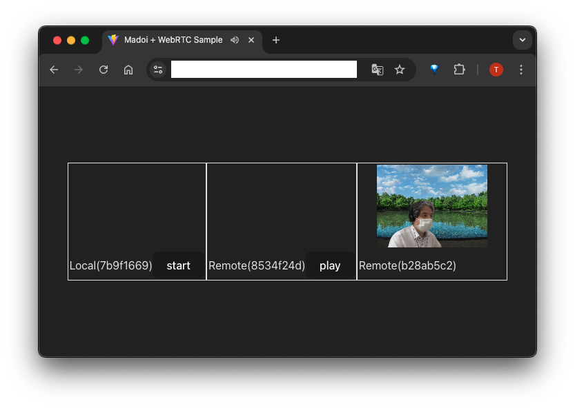

# madoi-sample-ts-react-webrtc-simple

WebRTCを使って映像と音声を送受信するサンプルアプリケーションです。
複数人でのビデオ会議が行えます。
シグナリングサーバには、[Madoi](https://github.com/kcg-edu-future-lab/madoi)を利用しています。

画面例:


- `start`ボタンをクリックすると音声と映像の送信を開始します。
- ブラウザのセキュリティ機能により、受信した映像が表示されない場合があります。その場合は`play`ボタンが表示され、これをクリックすると映像が表示されます。

※ 画面内の仮想背景はMacOSの機能を利用しています。サンプルアプリ内での実装は行なっていません。

# 機能

シンプルなビデオ会議サンプルアプリです。以下の機能が実装されています。

- Madoiによるシグナリング
  - [Madoi](https://github.com/kcg-edu-future-lab/madoi)サーバを利用し、WebRTC接続の確立に必要なメッセージを送受信します。
- 音声と映像の送信開始/停止
  - `start`ボタンをクリックすると、マイクとカメラを取得し、音声と映像の送信を開始します。開始後`stop`ボタンが表示され、クリックすると送信を停止します。

ブラウザのWebRTC APIのみを仕様しており、他のライブラリやサービスは使用していません。

# 動作環境

Chromeでの動作確認を行なっています。

WebRTCのシグナリング(ブラウザ同士での接続に必要な情報を交換する手順)を行うため、Madoiサーバが必要です。
docker-composeを使うことで、ローカルマシン上でMadoiとこのサンプルアプリ一式を起動できます(下記の`実行方法`参照)。

# 実行方法

## Madoiの起動

適当なディレクトリで以下のコマンドを実行し、Madoi の madoi-volatileserver を起動してください。詳細は、[MadoiのREADME](https://github.com/kcg-edu-future-lab/madoi)も参照してください。


```bash
git clone https://github.com/kcg-edu-future-lab/madoi
cd madoi
docker compose up
```

`docker compose up`を実行すると、Madoiのビルドが行われ、volatileserverが起動します。


## サンプルアプリのcloneと設定変更

まず、このリポジトリをcloneしてください。

```bash
git clone https://github.com/kcg-edu-future-lab/madoi-sample-ts-react-webrtc-simple
cd madoi-sample-ts-react-webrtc-simple
```

次に /src/keys.ts.sample をコピーして、 /src/keys.ts を作成し編集して、適切に設定を行なってください。

```ts
// Madoi設定
export const madoiUrl = "ws://localhost:8080/madoi/rooms";
export const madoiKey = "MADOI_API_KEY";
export const madoiRoomId = "madoi-sample-ts-react-webrtc-simple-sadfo22023";
```

MadoiサーバのデフォルトのMADOI_API_KEYは、[docker-compose.yml](https://github.com/kcg-edu-future-lab/madoi/blob/master/docker-compose.yml)を参照してください。


## サンプルアプリの起動

次に以下のコマンドを実行すると、コンテナ内でPresenceが起動します。
このコマンドは、Node.jsのバージョン22のイメージ(node:22)を使用して、Presenceを開発モードで起動(`npm run dev`)するものです。

```bash
docker compose up
```

起動後、http://localhost:5137/ にアクセスすると、サンプルアプリをブラウザで利用できます(ポートを変更するには、vite.config.ts.dockerファイルを編集してください)。

node.jsをローカル環境にセットアップすれば、ローカルでの開発モード起動(`npm run dev`)や静的ビルド(`npm run build`)も可能です。
Webサーバに配備する場合は、madoi-volatileserverもサーバに配備し、そのURLとキーを `keys.ts` に設定して静的ビルドを行ってください。distディレクトリ内に生成されるビルド結果をWebサーバに配置すれば、サーバ経由で複数のマシンからサンプルアプリを利用可能です。


# 技術メモ

以下の技術やライブラリを利用しています。

* WebRTC
  * ブラウザ同士で映像や音声を送受信するための技術です。
  * このサンプルでは、ウェブブラウザが用意している[API](https://developer.mozilla.org/ja/docs/Web/API/WebRTC_API)のみを使用しています。
  * 参加者間で相互に接続します(P2P型)。そのため人数が増えると負荷が上がりやすく、大人数での利用には向いていません。
  * [Peer](https://github.com/kcg-edu-future-lab/madoi-sample-ts-react-webrtc/blob/main/src/Peer.ts)クラスにWebRTCを使う処理がまとめられています。
  * [Room](https://github.com/kcg-edu-future-lab/madoi-sample-ts-react-webrtc/blob/main/src/Room.ts)クラスで、ルーム関連イベントの対応とシグナリングのための送受信処理を行っています。
* WebRTCネゴシエーション
  * WebRTCでは、接続開始時や送受信する内容(音声/映像の有無など)および通信状況の変化時に、アプリケーション間で接続方法の交換が行われます。この際、P2P通信の実現に必要ないわゆるNAT越えのための情報を提供する外部サーバ(STUNサーバ。Google等が無償で提供)も利用されます。どのようなタイミングで交換が開始され、いつ終了するかを完全に理解することは難しいため、このサンプルでは相手側に送信すべき情報が生じるとその都度送信しています(TrickleICE)。
  * それでもなお、双方が同時にビデオ送信を開始した場合など、接続方法の交換の開始が競合する状態が起こり得るため、これを解決する[Perfect Negotiation Pattern](https://developer.mozilla.org/en-US/docs/Web/API/WebRTC_API/Perfect_negotiation)を実装してあります。ただし名前ほど大袈裟なものではなく、競合した場合は後から参加した側が身を退くという方法です(参考: [WebRTCのPerfect negotiationについて](https://leaysgur.github.io/posts/2019/12/05/095721/))。
* Madoi
  * WebRTCのシグナリング(接続に必要な情報を交換する処理)に[Madoi](https://github.com/kcg-edu-future-lab/madoi)サーバを利用しています。そのためクライアントライブラリ([madoi-client](https://www.npmjs.com/package/madoi-client))を導入しています。
  * Madoiサーバはオブジェクトの状態管理機能を備えていますが、汎用WebSocketメッセージ配信サーバとしても利用できます。
  * このサンプルでは、WebRTC APIの利用にあたって他の参加者へメッセージを送る必要が生じた場合([Peer](https://github.com/kcg-edu-future-lab/madoi-sample-ts-react-webrtc/blob/main/src/Peer.ts)が`sendSignalNeeded`イベントを発生させる)に、Madoiを用いて送っています。
  * Madoiは参加者間のメッセージ交換やオブジェクト状態管理に利用でき、CRDTにも対応しているので、チャットや共同編集テキストなど、さまざまなコラボレーションツールを追加する際に便利です。Madoiを使ったコラボレーションツールの実装例は、[Presence](https://github.com/kcg-edu-future-lab/presence)を参考にしてください(ちなみにPresenceでもビデオ会議機能を実装していますが、こちらは[SkyWay](https://skyway.ntt.com/ja/)を利用しています)。
* React
  * UIの表示にはReactを使っています。
  * 主な処理内容は各種コンポーネント(UI, MediaStream, Room)のつなぎ込みと状態変更時の画面更新です。詳細は[App.tsx](https://github.com/kcg-edu-future-lab/madoi-sample-ts-react-webrtc-simple/blob/main/src/App.tsx)を参照してください。
  * 画面更新に関わる状態としては、以下があります。
    * 他の参加者のPeer。Roomクラスが管理。ビデオ表示枠(divやvideoタグ)に反映。
    * 自身のMediaStream(カメラ/マイク)。playボタン(buttonタグ)に反映。
* madoi-react
  * ReactでMadoiを使ったコードを簡潔にするため、[madoi-react](https://www.npmjs.com/package/madoi-client-react)を利用しています。
  * Madoiが発生させるイベント(ルーム管理やメッセージ受信関連)を受け取るメソッドにデコレータを指定し、useSharedModelフック経由でクラスを使用すると、イベントが発生した際にメソッドが呼ばれ、その後Reactの再レンダリングが行われます。再レンダリングは、@CaseStateUpdateデコレータで無効にできます。[Room](https://github.com/kcg-edu-future-lab/madoi-sample-ts-react-webrtc/blob/main/src/Room.ts)クラスでこれらの仕組みが使われています。
  * 上記[Presence](https://github.com/kcg-edu-future-lab/presence)の[VideoMeetingOwnModel](https://github.com/kcg-edu-future-lab/presence/blob/main/src/components/videomeeting/model/VideoMeetingOwnModel.ts)でも同様の仕組みを利用しています。
  
